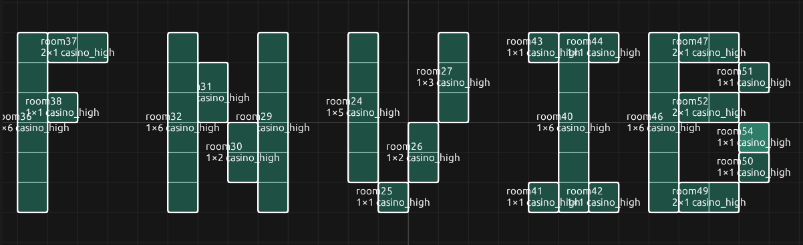

# FNV Interior Builder

Fallout: New Vegas Interior Builder (FNVIB) is a tool to simplify some aspects of building interior cells in Fallout: New Vegas.

## Quick Start:

* Use a simple graphical UI to construct the layout of your interior.
* For each room/hallway, choose the following from several preset options:
    - "Kit" (room type: office, factory, utility, etc)
    - Furniture
    - Floor clutter
    - Wall decorations
    - Lighting
* The tool will construct the rooms per your specifications
    - Some furniture (desks, shelves, etc) will be placed with clutter atop them
    - Navmeshes generated automatically
    - Doors are generated between each room, chosen to fit one of the adjoining rooms (hotel, office, etc)
    - COCMarker will be placed in the first room
    - Northmarker will be placed in the cell (assume the top of the UI is North)
* Export a .esp file with a cell matching the specifications
* Edit the .esp in the GECK or use zMerge to combine it with other files

## Limitations

* Not every kit has all of the necessary pieces.
    - I.e. the Enclave kit does not have corner doors. The tool should use a sensible replacement (i.e. a corner with no doors). If the structure of a room seems incorrect, check the GECK to see if the correct piece exists.
* Many things are "best effort." Navmeshes run through furniture. The orientation of clutter on surfaces may make no sense, or be floating in odd places.
* This isn't meant to be a fire and forget solution. It's meant to handle \~70-80% of the grunt work, so you can fine tune in the GECK.
* You can export a room to .toml file, and you can use the file at the command-line to generate the room, but you can't (currently) load the .toml file into the UI.

## Extensibility

The program (fnvib.exe) contains the logic, but all of the _objects_ are defined in content_list.toml.
There are a _lot_ of objects in New Vegas, and I ceetainly didn't add them all.
I didn't even look at the DLC content.
Most objects need a variety of parameters (rotation, offset, etc) to be placed correctly, and it's a lot of work to cover _every_ object.
But any missing objects can be loaded into the content_lists.toml file, using existing items as examples.
This also means that custom assets are easy to incoporate.
If you have unique room kits, furniture, or clutter, you can add them into content_lists.toml and use them in room generation.

## Inspiration

I found that in creating mods, I get tied up in the details.
Constructing rooms was easy, but as dug into the details (furniture, clutter, etc) it would take a lot of time - searching through the object palette to find the right thing, placing it down so its orientation was correct, etc.
I don't have a lot of time these days, so I like to be effective with the time I have.
This tool should save on much of the minutiae, so you can focus on getting the important details just right.

